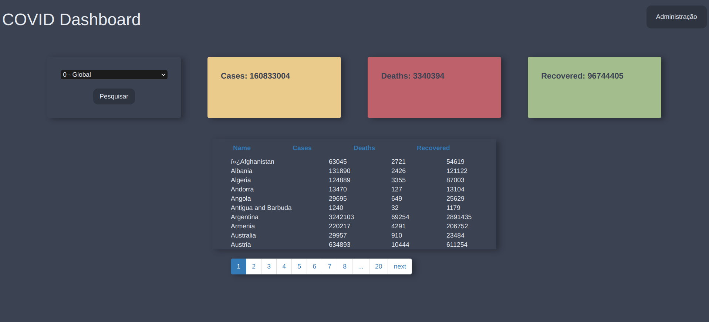
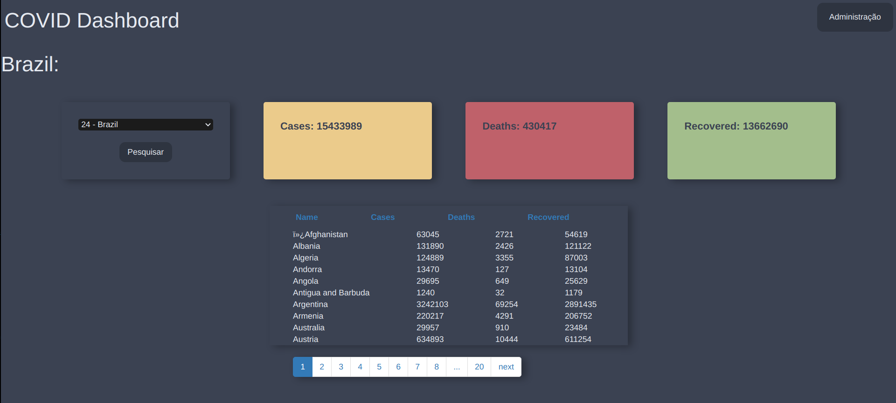

# Monitor Covid 19 Django

**Andrew Costa Silva, andrew.costa@sga.pucminas.br**

**João Guilherme Martins Borborema, jborborema@sga.pucminas.br**

---

Curso de Engenharia de Software, Unidade Praça da Liberdade

_Instituto de Informática e Ciências Exatas – Pontifícia Universidade de Minas Gerais (PUC MINAS), Belo Horizonte – MG – Brasil_

---

_**Resumo**. Este trabalho está inserido em um contexto de um painel de controle contendo as estáticas de infecção da pandemia de Covid-19 tanto globalmente quanto em cada país, a solução utiliza como base framework Django. A aplicação está disponível em 

---

## 1. Introdução

### 1.1. Contextualização

Este trabalho está inserido em um contexto do cenário da pandemia global de Covid 19, doença esta causa por um tipo de coronavirus.

### 1.2 Problema

No enfoque ao desenvolvimento de sistemas distribuídos, . Devido à isso propoe-se o uso de um sistema web baseado no modelo Model Template View aplicado ao _framework_ Django.

### 1.3. Objetivo Geral

O objetivo deste trabalho é elaborar uma solução executável via navegador _web_ sobre um _dashboard_ - painel de controle, sobre estáticas sobre a pandemia de covid 19, no qual um adminstrador poderá estar atualizando as informações e um usuário não autenticado possa acessar as informações.

### 1.4. Objetivos Específicos

São os objetivos específicos deste trabalho:

- Aplicar os conhecimentos obtidos na disciplina de Desenvolvimento de Sistemas Móveis e Distribuídos;

- Disponibilizar a execução da aplicação em um ambiente não *localhost*

- Ser possível executar a solução via navegador *web*.

## 2. Projeto da Solução

### 2.1. Requisitos funcionais

| No.           | Descrição                       | Prioridade |
| ------------- |:-------------------------------:| ----------:|
| 01 | O sistema deve possuir um usuário admin | Alta  |
| 02 | O sistema deve possuir um model que armazenará os dados do COVID-19 e um model que armazena os nomes dos países |  Alta |
| 03 | O sistema deve possuir um CRUD simples para os dados do COVID-19. | Alta  |
| 04 | O cadastro dos dados deve possuir um combo box que carrega os dados do model de países.| Alta |
| 05 | Apenas o usuário admin poderá cadastrar dados na tabela do COVID-19 | Alta|
| 06 | Os dados da tabela devem ser exibidos na página principal, aberta e pública para qualquer usuário sem a necessidade de login. | Alta |
|07|Deverá ser criado um layout para a tabela|Media|

### 2.2. Tecnologias

Para a realização deste trabalho foram utilizadas as seguintes tecnologias:

- **Django**: _Framework_ de desenvolvimento de aplicações _web_ _open source_ em Python, seu objetivo é estimular o uso de boas práticas no _design_ de software para que o desenvolvimento possa ser realizado de forma rápida.
- **django-tables2**: Biblioteca para o Python de criação de tabelas em Html, seu objetivo é simplificar a tarefa de transformação de dados em tabelas Html oferencendo ferramentas de paginação e ordenação.
- **Heroku**: Plataforma Paas (*Plataform as a Service*) em nuvem que possibilita a construção, execução e operação de aplicações simplificando o caminho de entrega para os usuários, utilizado para publicação online do trabalho.

## 3. Sistema desenvolvido

Para a execução da aplicação no modo de administração é necessário acessar com as seguintes credenciais:

| |  |   |
| --- |:---:| ---:|
| usuário | `admin`|
| senha|`password`|

1. O usuário ao entrar na aplicação poderá visualizar os dados de casos, mortes e recuperados de todos os países e uma tabela com dados de cada país em específico.

2. O usuário poderá filtrar os dados de acordo com o país ao selecionar o nome do país e confirmar a pesquisa.

## 4. Avaliação

O atual trabalho é apenas uma simulação de dashboard de estátiscas de infecção de Covid, não sendo possível utilizar em um cenário real em produção, além disso os dados utilizados neste repósitorio foram coletados em 14 de maio de 2021. Entretanto, o sistema possui as funcionalidades de uma aplicação em django com sistema de _Create Retrieve Update Delete_ de uma _dashboard_,como a possibilidade de o administrador cadastrar o número de infecções e o usuário não autenticado acessar as informações podendo selecionar se deseja visualizar o número de casos globais ou de um determinado país.

## 5. Conclusão

O presente trabalho propos um novo desafio por se tratar de uma linguagem que estudada para a utilização no desenvolvimento deste trabalho, como experiência foi possível identificar que houve uma ótima curva de aprendizagem e que a mesma ocorreu de forma rápida e natural. Conclui-se que o modelo arquitetural do Django oferece novos caminhos para o desenvolvimento rápido de aplicações web em Python.
